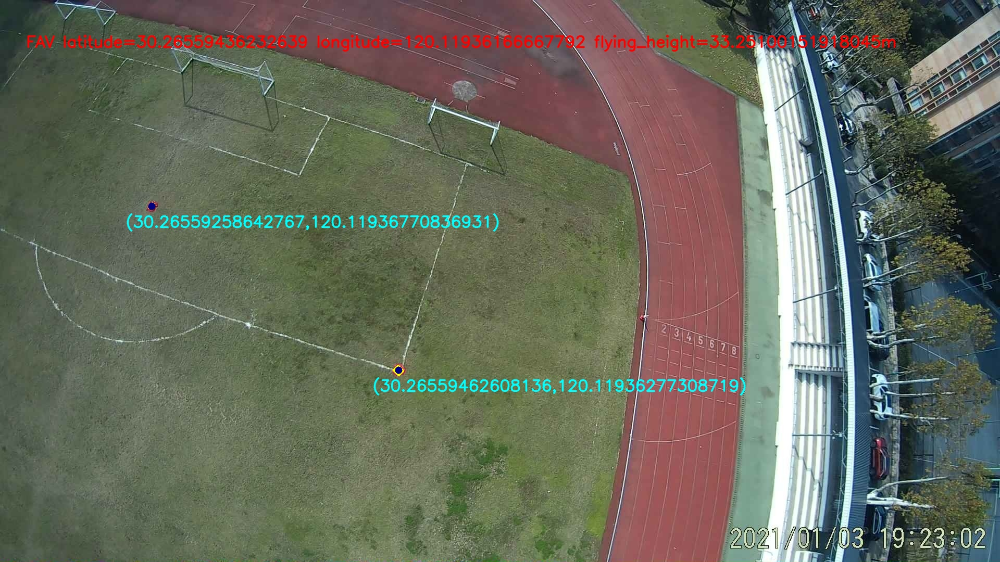

# FAV-Localization
This is the code repository for the paper "On-board Monocular Vision-based Ground Target Recognition and Localization System for a Flapping-wing Aerial Vehicle". The source code that implements some of the main functions is disclosed here.

## Installation (Linux Recommend)
    conda create -n fav_localization python=3.7
    conda activate fav_localization
    conda install numpy
    conda install opencv
    conda install scipy
    conda install -c conda-forge geopy
    pip3 install haversine

## Usage
The relevant parameters required for program operation are saved in param.py in the _fav_localization/parameters_ and can be modified as needed.

To run program,

    cd fav_localization
    conda activate fav_localization
    python3 fav_localization.py

And the result will be saved in the _fav_localization/results_

 

[Jin Y, Ren Y, Song T, et al. On-board Monocular Vision-based Ground Target Recognition and Localization System for a Flapping-wing Aerial Vehicle[C]//Proceedings of the 2023 4th International Conference on Computing, Networks and Internet of Things. 2023: 278-285.](https://doi.org/10.1145/3603781.3603829)
